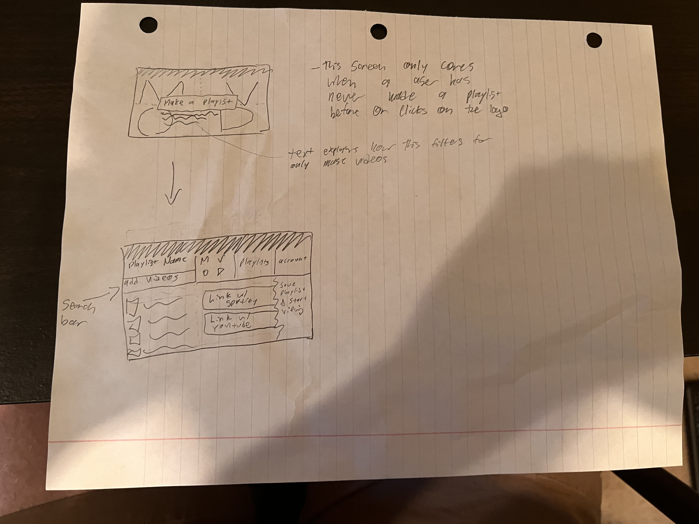
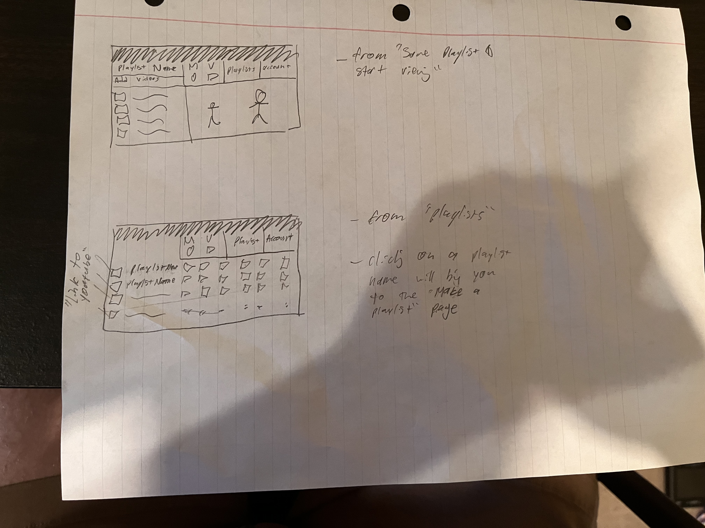

# ReactMusicVideoWebsite


## Large scale project idea

The original idea for this project was to create a website which could make playlists of music videos from youtube. There would be a feature that would allow users to add songs to playlists and convert their playlists from streaming platforms such as spotify into music video playlists. The program would also filter through the videos and only add real music videos. A demo of this feature is in my project here: https://github.com/owenkutzscher/ReactMapping. This is still a work in progress. It currently displays clickable thumbnails from a youtube playlist. Clicking on a thumbnail sends you to the video. 

Below is the original PRD idea:

## PRD: Music Video Playlist Maker


Summary and Background:

I’m sick of youtube recommending the same music videos. There are plenty of songs I like with music videos I’ve never seen. Another problem is sometimes I have a specific playlist I want to listen to. I’d like to watch music videos for that “vibe”. But I have no way of doing this quickly and easily. This is especially the case for restaurants and businesses that make money off entertaining guests. Also, I’d like to get more connected to the artists I listen to. Many of them have music videos I forget to look up and view when I actually have time to see them. Lastly, there exists an app right now that serves this purpose but it is tedious, and requires more steps than the average person is willing to sit through.


Target Users:

The target users are restaurant workers and everyday people. When they are relaxing, entertaining people, hanging out with friends, spending time alone.


Critical User Journeys:

When the problem is solved the user can quickley watch music videos from playlists.


Functional Requirements:

The program should be easy and quick to access. The program should integrate with spotify and youtube. The user should be able to choose if they want to have only music videos in the playlist (for a streamlined viewing experience).


Supporting Documents:

Supporting documents not necessary.


Go To Market:

Will be launched as an app and / or website. Marketing could be done via ads. If there are enough users on the app we could add ads to the program. (But I won’t get too ahead of myself lol I doubt I’d get enough traffic.)


## Below are some wireframes for what I intend the website to look like:





## How to run

Navigate to the ReactMusicVideoWebsite folder

in the terminal run: npm run dev

visit http://localhost:3000

If running correctly you should see a collection of music videos from Pitbull


This is a [Next.js](https://nextjs.org/) project bootstrapped with [`create-next-app`](https://github.com/vercel/next.js/tree/canary/packages/create-next-app).

## Getting Started

First, run the development server:

```bash
npm run dev
# or
yarn dev
```

Open [http://localhost:3000](http://localhost:3000) with your browser to see the result.

You can start editing the page by modifying `pages/index.js`. The page auto-updates as you edit the file.

[API routes](https://nextjs.org/docs/api-routes/introduction) can be accessed on [http://localhost:3000/api/hello](http://localhost:3000/api/hello). This endpoint can be edited in `pages/api/hello.js`.

The `pages/api` directory is mapped to `/api/*`. Files in this directory are treated as [API routes](https://nextjs.org/docs/api-routes/introduction) instead of React pages.

## Learn More

To learn more about Next.js, take a look at the following resources:

- [Next.js Documentation](https://nextjs.org/docs) - learn about Next.js features and API.
- [Learn Next.js](https://nextjs.org/learn) - an interactive Next.js tutorial.

You can check out [the Next.js GitHub repository](https://github.com/vercel/next.js/) - your feedback and contributions are welcome!

## Deploy on Vercel

The easiest way to deploy your Next.js app is to use the [Vercel Platform](https://vercel.com/new?utm_medium=default-template&filter=next.js&utm_source=create-next-app&utm_campaign=create-next-app-readme) from the creators of Next.js.

Check out our [Next.js deployment documentation](https://nextjs.org/docs/deployment) for more details.
